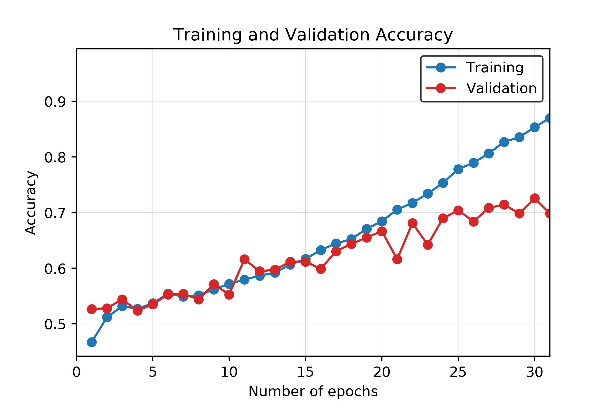

# Detecting Respiratory Disorders

## CS 7651 - Machine Learning (Team 7)

# Introduction

# Data
## Data Processing Pipeline & Feature Extraction
## Preprocessing
### Noise Reduction & Applying Audio Filtering Techniques

## Dimension Reduction (Applying PCA)

## Feature Extraction (Using Signal Processing)
### MFCC Method

# Classification Methods
## Support Vector Machines (SVM)
## Concurrent Neural Networks (CNN)

# Evaluation & Results
## SVM

Our best SVM model achieved an accuracy of 69%. Interestingly, the recall percentages correlate well with the distribution of classes in our data. When looking at the unbalanced dataset, as less training data was available in each class, the corresponding recall values also decreased. Figure x is the confusion matrix with percent recall values, and figure x illustrates this by normalizing the number of clips in each class and the recall of each class.

The unbalanced data could be the reason for our relatively low accuracy of 69%. The healthy class, which had the most data available (3642 clips) achieved a recall of 82%, while the both class, with the least data available (506 clips) achieved a recall of 37%.

## Neural Network

Our best CNN model achieved an accuracy of 71%. The normalized confusion matrix is shown in Figure x, and a graph of the training and validation accuracy is shown in Figure x.

As seen in Figure x, overfitting starts to happen at around the 20th epoch. Although more training at each epoch does result in a higher validation accuracy, the accuracy gain is much less when compared to the training accuracy.
Like the SVM model, the recall percentages for the CNN model also correlate well with the distribution of classes in our data. The graph of the normalized class distribution and recall comparison is shown in Figure x.

## Dataset
The dataset itself was a difficult dataset to work with. Aside from the unbalanced part of it that was discussed previously, there were various other features that could affect our accuracies.

One aspect of the data that likely reduced our accuracy was the format of the data itself. All the clips were of different lengths, ranging from 0.2 to 16.2 seconds. The clips were also not sampled at the same sampling rate. This required us to augment the data through zero-padding, cropping, filtering, and up-sampling or down-sampling, which removed from the truth of the actual data and could cause problems in the training process.

Another aspect of the data that could have reduced our accuracy was how the data was gathered. Across all the clips, there were four different recording devices used, two different acquisition modes, and six different locations of the chest that were recorded. Our models did not account for any of these differences.

# Discussion & Conclusion

# References
