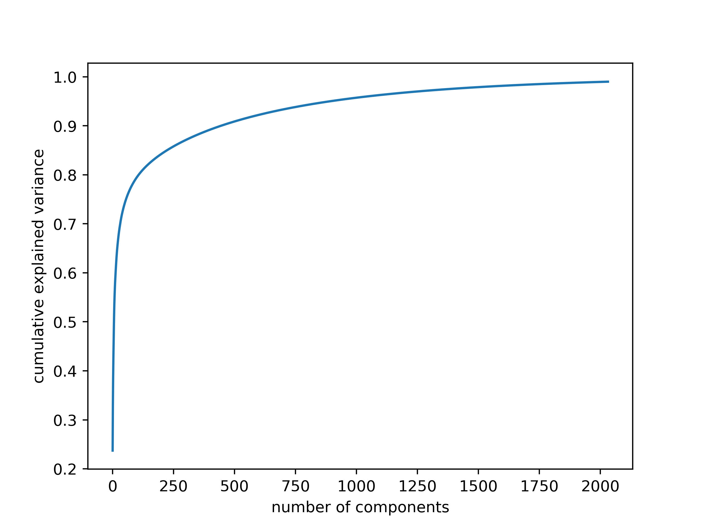
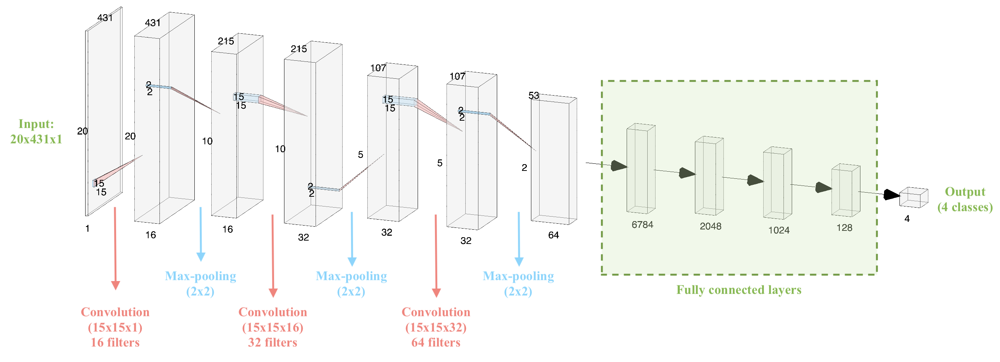

# Detecting Respiratory Disorders

## CS 7651 - Machine Learning (Team 7)

# Introduction
## Motivation
The emergence of the 2019 novel coronavirus (2019-nCoV) has caused a large global outbreak and major public health issues []. Viral pneumonia, difficulty in breathing and dyspnea became known as key symptoms in infected patients [] and in severe cases caused uncountable deaths since the virus outbreak [].  These circumstances that have dramatically impacted all aspects of our lives highlight the importance of  early and automated diagnosis of such respiratory disorders more than ever. Moreover, it emphasized the necessity of telemedicine and smart telediagnosis of disease while the availability of professional physicians are low and the risk of in-person check outs are high. 

The current situation has highly motivated us to consider our project as an opportunity to develop a telemedicine platform for remote, automated diagnosis of adventitious pathological sounds which can contribute to diagnosis of respiratory disorders. Our system may provide a better chance of benefiting from treatments as well as preventing the spread of the coronavirus. Moreover, in a broader context, it can assist pulmonologists to diagnose varying degrees of sound abnormalities and lung ailments including asthma, chronic obstructive pulmonary disease, pneumonia, infection, and inflammation of the airways and facilitate the long-term, remote monitoring and treatments in inexpensive, non-invasive, and safe ways. 

## Objective
In those COVID-19 cases, in which the infection has led to acute respiratory distress, breathing appears as distant sounds accompanied by coarse crackles and diffuse wheezes[]. Besides, most respiratory ailments are accompanied by the same sound anomalies during the patient’s inspiration and/or expiration cycles[]. Thus, the key fundamental, initial step in developing our telemedicine platform is to determine the presence of adventitious sounds and distinguish between four classes of wheeze, crackle, a combination of both, and normal breathing.

### Classifying Respiratory Sounds
#### Normal and Abnormal Lung Sounds

Vesicular or normal lung sounds are usually soft and low-pitched and heard during auscultation of the chest and lung surface of a healthy person.  That sound has a resulting quality during inspiration. This is generated by turbulent airflow within the lobes of the lungs. During expiration the sound becomes softer as air flows within the larger airways. The inhalation process is normally  2-3 times the length of the exhalation process []. On the other hand, adventitious or abnormal lung sounds consist of additional audible sounds during auscultation. This includes abnormal lung sounds such as crackles, wheezes, rhonchi, and stridor.  In this project, our focus would only be on wheeze and crackle. The type, duration, location, and intensity of each adventitious breath sounds can help classify signals [].

 
Figure 1:  
a) Typical waveform from normal breath - (dB/milisecond). It shows a typical respiratory cycle with time duration about 35 milisecond.  
b & c) Spectral Pitch & Frequency spectrogram for a normal breath (Hz/milisecond).

#### Wheeze
Wheezes are continuous, high-pitched adventitious lung sounds with the typical frequency range from 100 Hz to 5000 Hz and duration above 40 milisecond. Wheezes commonly occur at the end of the inspiratory phase or early expiratory phase as a result of the gradual opening or closing of a collapsed airway. They sound like a whistle when you breathe and are most audible during the expiratory phase. Aside from narrowed airways, wheezes can also be caused by inflammation secondary to asthma and bronchitis. If bilateral wheezing is heard in both lungs, this is an indication of bronchoconstriction. When wheezes are heard in only one lung this is referred to unilateral wheezing which indicates that a forigen body obstruction is presented []. 

 
Figure 2:  
a) Typical waveform from wheeze- (dB/milisecond). It shows a respiratory cycle with time duration about 40 milisecond.  
b & c) Spectral Pitch & Frequency spectrogram for a wheeze sound (Hz/milisecond).

#### Crackles
Crackles are discontinuous, short, explosive, lung adventitious sounds in the lung fields that have fluid in the small airways. Crackles can occur on both inspiration and expiration but are more common during the inspiratory phase. There are two types of fine and coarse crackles. The fine crackles are about 650 Hz and at least minimum time duration about 5 milisecond. While the frequency of the coarse crackles is about 350 Hz and the minimum duration about 14 miliseconds. Such frequency and time ranges shows that difference between the two is that fine crackles have a higher frequency and a shorter duration and are caused by a sudden opening of a narrowed or closed airway. The sound of fine crackles can be compared to that of salt heated on a frying pan. Coarse crackles, on the other hand, are louder, lower in pitch and last longer. They are caused by secretions in the airways. The sound of coarse crackles is like pouring water out of a bottle. Crackles are often associated with lung inflammation or infection like Cronic Obstructive Pulminary Disease (COPD), chronic bronchitis, pneumonia, and pulmonary fibrosis.

 
Figure 3:  
a) Typical waveform from crackle- (dB/milisecond). It shows a respiratory cycle with time duration about 50 milisecond.  
b & c) Spectral Pitch & Frequency spectrogram for a crackle sound (Hz/milisecond).

<iframe width="560" height="315" src="https://www.youtube.com/embed/epyYDJCaaL0" frameborder="0" allow="accelerometer; autoplay; encrypted-media; gyroscope; picture-in-picture" allowfullscreen></iframe>

# Data

Data is taken from the _Respiratory Sound Database_, created by two research teams in Portugal and Greece. It consists of 920 recordings. Each recording varies in length. A scatter plot of the length of recordings is given in **FIGURE**. Recordings were taken from 126 patients and each recording is annotated. Annotations are comprised of beginning and end times of each respiratory cycle and whether the cycle contains crackle and/or wheeze. Crackles and wheezes are called adventitious sounds and the presence of them is used by health care professionals when diagnosing respiratory diseases. The number of respiratory cycles containing each adventitious cycle is shown in **PLOT**.

## Preprocessing

Preprocessing of the data starts from importing the sound files, resampling and cropping them. Since the recordings were taken by two different research teams with different recording devices, there are 3 different sampling rates (44100 Hz, 10000 Hz and 4000 Hz). All recordings were resampled to 44100 Hz and all clips are made 5 seconds long by zero padding shorter clips and cropping the longer ones.  `librosa` library was used in this project for reading the audio data and extracting features.

### Feature Extraction (MFCC)

Mel Frequency Cepstrum Coefficients were used as features of the sound clips. MFCCs are widely used in speech recognition systems. They are also being used extensively in previous work on detection of adventitious respiratory sounds as they provide a measure of short term power spectrum of time domain signals. Both the frequency and time content are important to distinguish between different adventitious sounds, since different adventitious sounds can exist in a single clip at different time periods and they differ in duration. Therefore, MFCC is helpful in capturing the change in frequency content of a signal over time. Frequencies are placed on a mel scale, which is a nonlinear scale of frequencies whose distances are percieved to be equal by the human auditory system. Output of MFCC is a 2 dimensional feature vector (time and frequency), which was then flattened into a one dimensional array before further processing.  

A sample output from MFCC content of clips containing different adventitious sounds is given below.

**FIGURE**

### Dataset Partitioning
Since the dataset does not include seperate recordings for training and testing, we randomly partitioned the dataset into training (80%) and testing (20%) by maintaining the class distribution for both sets. For the first classification method (SVM), we perform a 5-fold cross validation to pick the hyperparameters, therefore, no seperate validation dataset is required. As for the second classification method (CNN), we split the training dataset so that 70% of the original dataset is used for training and 10% is used for validation. Fig. **XX1** illustrates the class distribution for CNN system.

 
Figure **XX1**. Distribution of the dataset to be used for CNN-based system

# Classification Methods

## Principal Component Analysis (PCA) and Support Vector Machines (SVM) in Pipeline
For the first classification method of our project, we combined an unsupervised learning method, PCA, with a supervised learning method, SVM. The main reason behind including PCA before SVM was to reduce the dimensionality of the dataset and hence increase the learning rate. The details for these methods are explained next.

###  Principal Component Analysis (PCA) for Dimensionality Reduction

The MFCC-based features exist in a 2-dimensional space where the first and second dimensions represent the time and frequency information, respectively. Hence, the   input data  where T is the number of time-windows and D is the number of frequency bins. As can be seen in the figures above, the features are sparsely distributed and most of these features show similar characteristics across different classes. This implies that the dataset contains significant amount of redundant information. In an effort to reduce the dimensionality of the dataset and hence increase the learning rate while keeping the variation within the dataset, we propose to utilize principal component analysis (PCA).

PCA is a commonly used unsupervised learning technique in machine learning that projects the dataset into a lower dimensional dataset in an optimal manner that maximizes the remained variance [1](#pca)  . PCA performs a linear transformation and is therefore useful for datasets that are linearly seperable. In conventional PCA application, the input data for each sample is represented as a vector (1-dimensional). Therefore, the whole dataset can be represented as a 2-dimensional matrix that consists the stacked input vectors. Firstly, the dataset is centered to avoid a biased projection. Later, the centered data matrix is expressed in singular value decomposition form. The projection is performed by keeping the largest singular values and their corresponding eigenvectors. The number of the singular values that are utilized can be determined manually or can be chosen so that the explained variance of the original dataset achieves a certain threshold.

Our MFCC-based features lie in a 2-dimensional space. To be able to utilize the conventional PCA scheme, we flatten the features so that the features are represented as a vector. Then, we can apply the common PCA procedure. However, PCA is not agnostic to different scalings of the features. Therefore, we standardize the data so that all features are similarly scaled.

To give a perspective of the dimensions, when the maximum length of the recording are limited to 5 seconds, the resulting MFCC features have the dimension 20 x 431. Therefore, we have 8620 features in total. As explained above, the values for most of these features are the same across the different classes and redundant. In Figure **XX2**, how the explained cumulative variance changes for increasing number of components is presented. We note that we still keep the 99% of the original variance when the dimensionality is reduced to 1916. This reduction is very significant because it becomes useful to increase the learning rate in the next step.

 
Figure **XX2**. Explained variance for increasing number of kept principal components

### Support Vector Machines (SVM)
As  the first supervised classification method, we trained Support Vector Machine (SVM) for four-class classification. SVMs rely on kernel methods to adapt to patterns of data, by nonlinearly mapping the data from original space into a higher dimensional space. A key initial step in SVM is normalizing the predictor or feature space for SVM training.  As discussed earlier our SVM is fed by the output of the PCA. Thus, such normalization is done as an initial step in PCA. That means the input for SVM is already normalized  to standardize features. The second step is choosing kernels and regularization parameters. Although there are automated ways of doing so, we avoided such automation, to prevent any potential overfitting of the model. Since our features are nonlinearly distributed in feature space, we chose the Radial Basis Function (RBF) to enhance SVM flexibility and robustness to fit the given data distribution. Mixture of SVM and RBF requires an appropriate tuning of SVM hyperparameters.

#### Parameters Tuning: 
The SVM parameters are determined through maximization of a margin-based criterion. This criterion is approximately optimized through two sub problems. First is related to margin maximization in the input space, and the second is related to determination of the extent of sample spread in the feature space. Thus, here our hyperparameters for SVM are: first, the soft margin parameter C in input space which is obtained by an analytical formula in terms of xxxx, second, the RBF kernel Gamma parameter in the feature space. 
##### RBF Parameters : Gamma & C
RBF parameters are Gamma and C. Gamma reshapes a decision boundary, by trying to assemble and cluster similar data points. and C parameter is called penalty parameter which controls the penalty of misclassification. 

We splitted data into training and testing partitions for cross validation.  In setting the fitness function, we calculated the root-mean-square deviation (RMSD) of the model over the test data. RMSD quantifies the difference between model predicted values and observed value. By minimizing the RMSD value, we optimized the values of parameters Gamma and C. Discussed approaches allow us to have more robustness after cross validation, more generalization across randomly split trst samples, and less bias between prediction and actual observations. The optimized Gamma is equal to xxx and C is xxx. 

The overal efficiency and accuracy result of our model is discussed in next parts. 

## Convolutional Neural Networks (CNN)

As the second classification approach, we propose to use a Convolutional Neural Network based system. The Convolutional Neural Network (CNN) is a neural network classification technique that is commonly used in image classification [2](#imagenet) [3](#vggnet). As opposed to the traditional neural networks, where each input feature is associated with seperate parameters, in CNN, parameters are shared among the features. This allows the network for learning local features. By this means, CNN automatically learns the important features without requiring extra feature extraction.
CNN-based architectures construct a deep layered structure through convolutional kernels, which are learned from the data to extract complex features. Furthermore, CNN is computationally efficient. Convolution and pooling operations allow for parameter sharing and efficient computation.

In our project, the MFCC-based features are 2-dimensional. Therefore, they can be treated as images and the assignment can be translated into an image classification task. After experimenting with commonly used CNN structures such as AlexNet [2](#imagenet) and VGGNet [3](#vggnet), we designed our own CNN-based neural network structure as shown in Fig. **??**.

Our network includes three convolutional layers (each followed by a max-pooling layer) and four fully connected layers as well as the output layer. The convolution operations are performed with a kernel size of 15x15 and stride of 1. The fully connected layers have 6784, 2048, 1024 and 128 neurons, respectively. The activation function for all convolutional and fully connected layers is Rectified Linear Unit (ReLU). The output layer, consisting of 4 nodes, implements a softmax activation function. The max-pooling operations are performed with a kernel of size 2x2 and stride 1.

 
Figure XX. Architecture of the CNN-based neural network

The proposed neural network system above consists of over 16 million parameters to be trained. Considering the dataset size, this is a significantly large number of parameters. To increase the training speed, we use Adam optimizer [4](#adam). We specify our loss function as categorical cross entropy

.

where,

,

and the number of classes is C = 4. Then, we train our algorithm and evaluate it on the validation set to choose the the number of epochs.

# Evaluation & Results
## SVM Results

Our best SVM model achieved an accuracy of 69%. Interestingly, the recall percentages correlate well with the distribution of classes in our data. When looking at the unbalanced dataset, as less training data was available in each class, the corresponding recall values also decreased. Figure 0 is the confusion matrix with percent recall values, and figure 1 illustrates this by normalizing the number of clips in each class and the recall of each class.

 
Figure 0. Normalized confusion matrix for SVM model

 
Figure 1. Comparison of normalized class distribution and normalized recall for each class in SVM model

The unbalanced data could be the reason for our relatively low accuracy of 69%. The healthy class, which had the most data available (3642 clips) achieved a recall of 82%, while the both class, with the least data available (506 clips) achieved a recall of 37%.

## CNN Results

Our best CNN model achieved an accuracy of 71%. The normalized confusion matrix is shown in Figure 2.

 
Figure 2. Normalized confusion matrix for CNN model

Overfitting starts to happen at around the 20th epoch. After the 20th epoch, the testing accuracy starts to increase at a noticeably slower rate than the training accuracy. The testing loss also stops decreasing at this point, while the training loss continues to decrease. Although more training at each epoch does result in a higher validation accuracy, the accuracy gain is much less when compared to the training accuracy. A graph of the training and validation accuracy is shown in Figure 3, and a graph of the training and validation loss is shown in Figure 4.

 
Figure 3. Training and validation accuracy for CNN model across 30 epochs

 
Figure 4. Training and validation loss for CNN model across 30 epochs

Like the SVM model, the recall percentages for the CNN model also correlate well with the distribution of classes in our data. The graph of the normalized class distribution and recall comparison is shown in Figure 5.

 
Figure 5. Comparison of normalized class distribution and normalized recall for each class in CNN model

## Dataset Evaluation
The dataset itself was a difficult dataset to work with. Aside from the unbalanced part of it that was discussed previously, there were various other features that could affect our accuracies.

One aspect of the data that likely reduced our accuracy was the format of the data itself. All the clips were of different lengths, ranging from 0.2 to 16.2 seconds. The clips were also not sampled at the same sampling rate. This required us to augment the data through zero-padding, cropping, filtering, and up-sampling or down-sampling, which removed from the truth of the actual data and could cause problems in the training process.

Another aspect of the data that could have reduced our accuracy was how the data was gathered. Across all the clips, there were four different recording devices used, two different acquisition modes, and six different locations of the chest that were recorded. Our models did not account for any of these differences.

Furthermore, considering the number of parameters to be trained (over 16 million) in the CNN implementation, the dataset size is very small (4827 total samples) and this restricts the learning capability of the network. 
# Discussion & Conclusion

For the CNN structure, the accuracy results turned out to be comparable for different kernel sizes (3x3, 5x5, and 11x11), therefore, we only report the results for the best performing kernel size (15x15). **-->Can also be mentioned somewhere in the results**

In addition to the 2 dimensional CNN, we tried to use 1 dimensional CNN. For that, we used two different input types: 1) Flattened MFCC coefficients of size 8620x1, 2) Features obtained after applying PCA (1916x1). Training the former network took significantly long amount of time (300 s/epoch) since it required training 71 million parameters. The highest accuracy achieved with such a structure was 63%. On the other hand, training the second network took considerably less time (70 s/epoch) at the expense of significantly lower accuracy (54%). These results indicate that 2 dimensional CNN structure outperforms 1 dimensional CNN structures for this dataset. **-->Can also be moved to the results**

Possible considerations to increase the performance of the system are listed as follows:
* Using a larger dataset that has a balanced class distribution,
* Utilizing other feature extraction methods such as short-time Fourier transform (STFT),
* Applying advanced signal processing techniques to extract more informative and distinctive features from the recordings,
* ??

# References
<a name="pca">[1]</a>: Wold, Svante, Kim Esbensen, and Paul Geladi. "Principal component analysis." Chemometrics and intelligent laboratory systems 2.1-3 (1987): 37-52.

<a name="imagenet">[2]</a>: Krizhevsky, Alex, Ilya Sutskever, and Geoffrey E. Hinton. "Imagenet classification with deep convolutional neural networks." Advances in neural information processing systems. 2012.

<a name="vggnet">[3]</a>: Simonyan, Karen, and Andrew Zisserman. "Very deep convolutional networks for large-scale image recognition." arXiv preprint arXiv:1409.1556 (2014).

<a name="adam">[4]</a>: Kingma, Diederik P., and Jimmy Ba. "Adam: A method for stochastic optimization." arXiv preprint arXiv:1412.6980 (2014).
