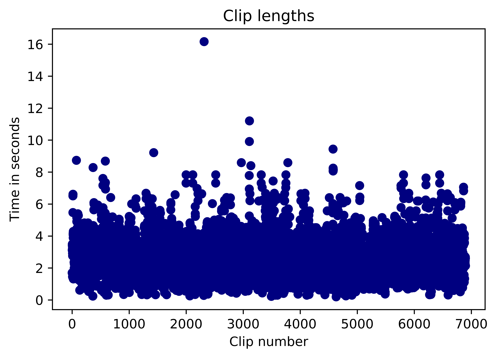
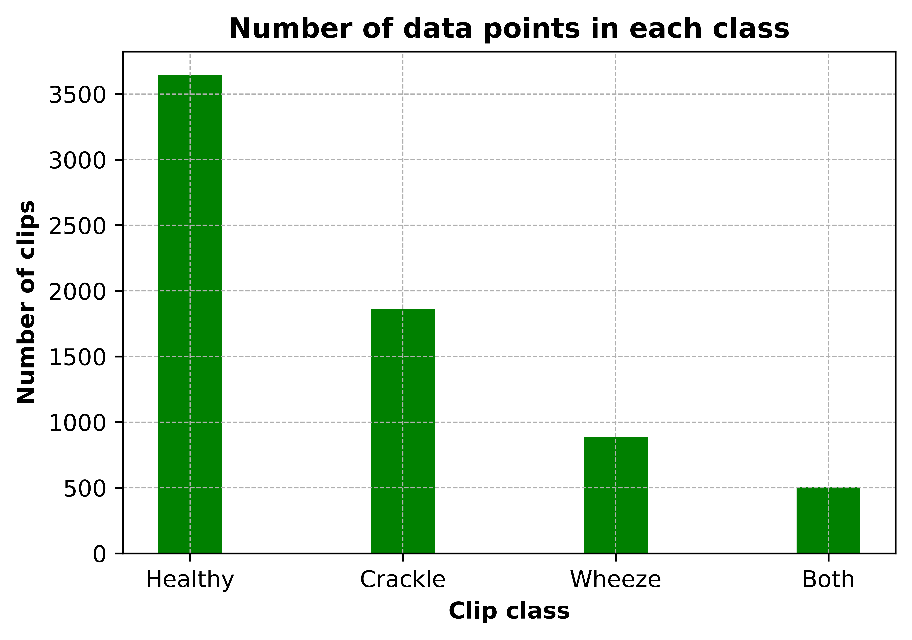
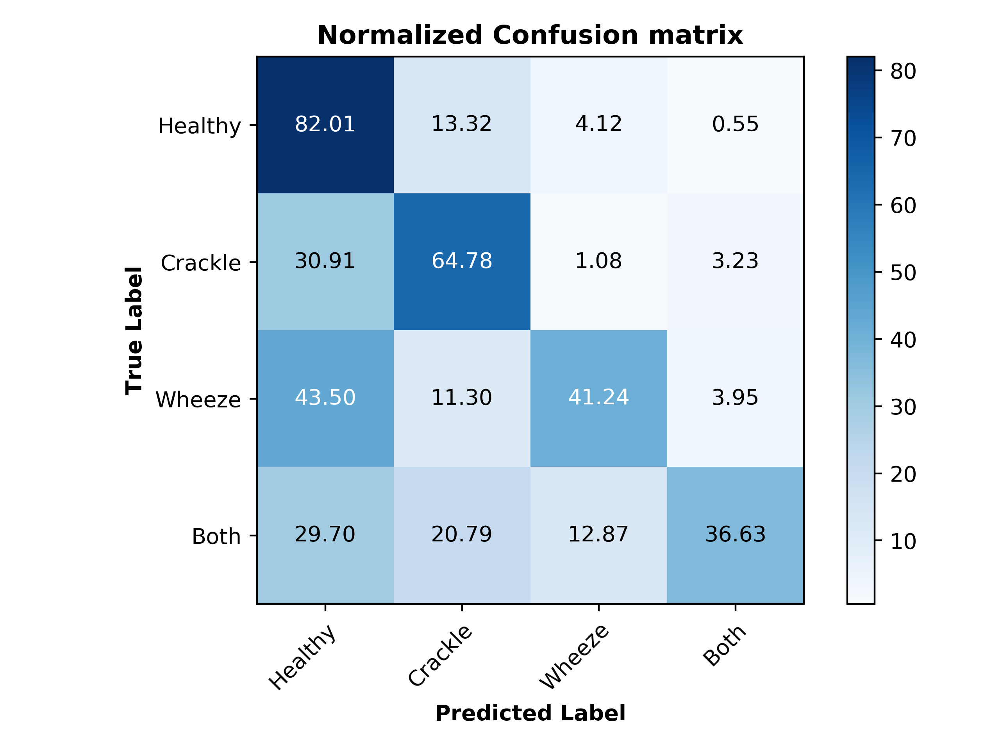
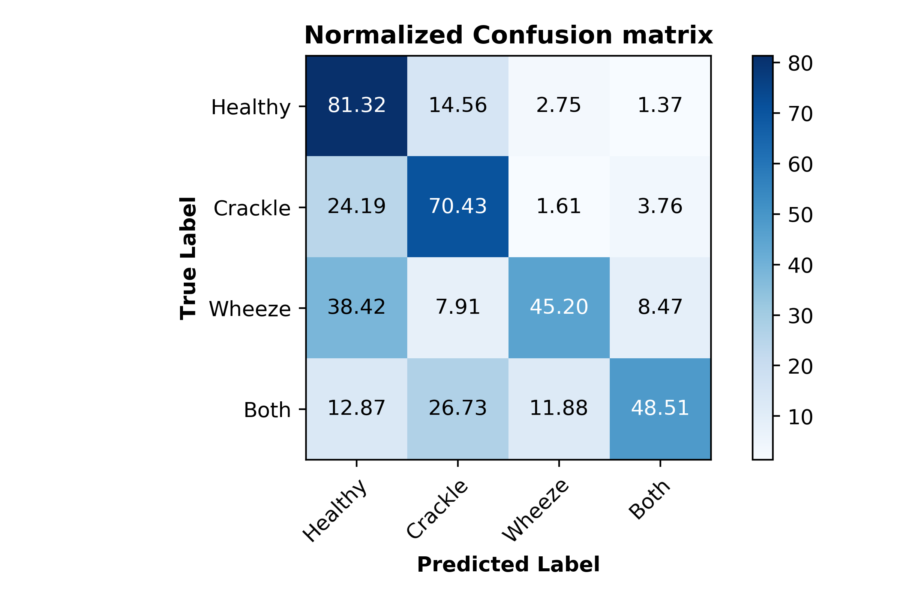
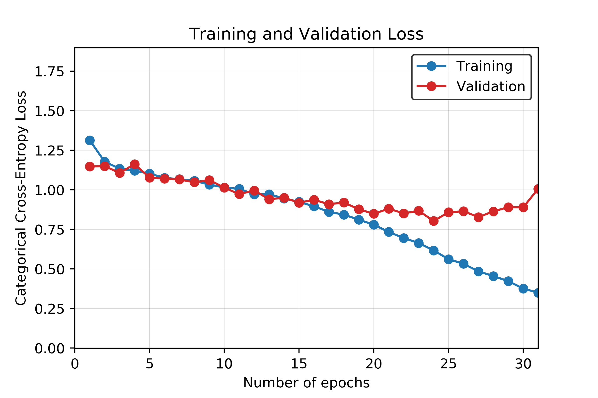

# Detecting Respiratory Disorders

## CS 7651 - Machine Learning (Team 7)

# Introduction

# Data

Data is taken from the _Respiratory Sound Database_ created by two research teams in Portugal and Greece. It consists of 920 recordings. Each recording is varying in length. A scatter plot of the length of recordings is given in **FIGURE**. Recordings were taken from 126 patients and each recording is annotated. Annotations are comprised of beginning and end times of each respiratory cycle and whether the cycle contains crackle and/or wheeze. Crackles and wheezes are called adventitious sounds and presence of them are used by health care professionals when diagnosing respiratory diseases. Number of respiratory cycles containing each adventitious cycle is shown in **PLOT**.

## Preprocessing

Preprocessing of the data starts from importing the sound files, resampling and cropping them. Since the recordings were taken by two different research teams with different recording devices, there are 3 different sampling rates (44100 Hz, 10000 Hz and 4000 Hz). All recordings were resampled to 44100 Hz and all clips are made 5 seconds long by zero padding shorter clips and cropping the longer ones.  `librosa` library was used in this project for reading the audio data and extracting features.

### Feature Extraction (MFCC)

Mel Frequency Cepstrum Coefficients were used as features of the sound clips. MFCCs are widely used in speech recognition systems. They are also being used extensively in previous work on detection of adventitious respiratory sounds, they provide a measure of short term power spectrum of time domain signals. Both the frequency and time content are important to distinguish between different adventitious sounds, since different adventitious sounds can exist in a single clip at different time periods and they differ in duration. Therefore, MFCC is helpful in capturing the change in frequency content of a signal over time. Frequencies are placed on a mel scale, which is a nonlinear scale of frequencies whose distances are percieved to be equal by the human auditory system. Output of MFCC is a 2 dimensional feature vector (time and frequency), which was then flattened into a one dimensional array before further processing.  

A sample output from MFCC content of clips containing different adventitious sounds is given below.

**FIGURE**

### Dimension Reduction (Applying PCA)

PCA method was used in order to reduce the dimension of the flattened MFCC feature vectors. Plot given below shows the relationship between the number of principal components and retained variance.

**FIGURE**

# Classification Methods
## Support Vector Machines (SVM)
## Concurrent Neural Networks (CNN)

# Evaluation & Results
## SVM

Our best SVM model achieved an accuracy of 69%. Interestingly, the recall percentages correlate well with the distribution of classes in our data. When looking at the unbalanced dataset, as less training data was available in each class, the corresponding recall values also decreased. Figure x is the confusion matrix with percent recall values, and figure x illustrates this by normalizing the number of clips in each class and the recall of each class.

The unbalanced data could be the reason for our relatively low accuracy of 69%. The healthy class, which had the most data available (3642 clips) achieved a recall of 82%, while the both class, with the least data available (506 clips) achieved a recall of 37%.

## Neural Network

Our best CNN model achieved an accuracy of 71%. The normalized confusion matrix is shown in Figure x, and a graph of the training and validation accuracy is shown in Figure x.

As seen in Figure x, overfitting starts to happen at around the 20th epoch. Although more training at each epoch does result in a higher validation accuracy, the accuracy gain is much less when compared to the training accuracy.
Like the SVM model, the recall percentages for the CNN model also correlate well with the distribution of classes in our data. The graph of the normalized class distribution and recall comparison is shown in Figure x.

## Dataset
The dataset itself was a difficult dataset to work with. Aside from the unbalanced part of it that was discussed previously, there were various other features that could affect our accuracies.

One aspect of the data that likely reduced our accuracy was the format of the data itself. All the clips were of different lengths, ranging from 0.2 to 16.2 seconds. The clips were also not sampled at the same sampling rate. This required us to augment the data through zero-padding, cropping, filtering, and up-sampling or down-sampling, which removed from the truth of the actual data and could cause problems in the training process.

Another aspect of the data that could have reduced our accuracy was how the data was gathered. Across all the clips, there were four different recording devices used, two different acquisition modes, and six different locations of the chest that were recorded. Our models did not account for any of these differences.

# Discussion & Conclusion

# References
